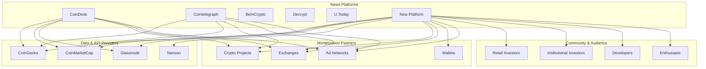

# Blockchain News Ecosystem Map

This map illustrates the key players and their relationships within the blockchain news ecosystem.

```mermaid
graph TD
    subgraph "News Platforms"
        A[CoinDesk]
        B[Cointelegraph]
        C[BeInCrypto]
        D[Decrypt]
        E[U.Today]
        F[New Platform]
    end

    subgraph "Data & API Providers"
        G[CoinGecko]
        H[CoinMarketCap]
        I[Glassnode]
        J[Nansen]
    end

    subgraph "Monetization Partners"
        K[Crypto Projects]
        L[Exchanges]
        M[Wallets]
        N[Ad Networks]
    end

    subgraph "Community & Audience"
        O[Retail Investors]
        P[Institutional Investors]
        Q[Developers]
        R[Enthusiasts]
    end

    A --> G
    A --> H
    A --> I
    A --> K
    A --> L
    A --> N

    B --> G
    B --> H
    B --> K
    B --> L
    B --> N

    F --> G
    F --> H
    F --> I
    F --> J
    F --> K
    F --> L
    F --> M
    F --> N

    F --> O
    F --> P
    F --> Q
    F --> R
```
